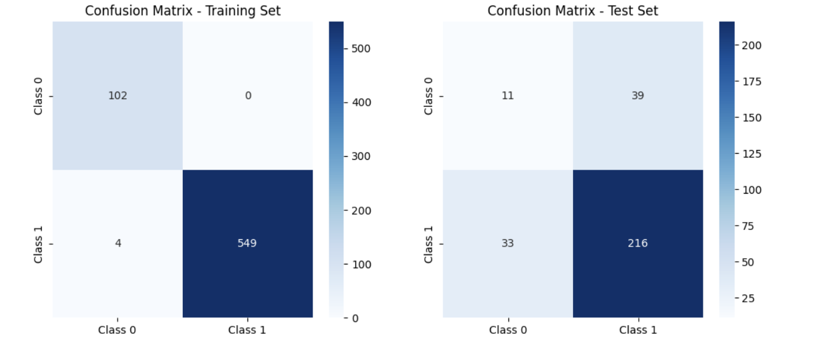
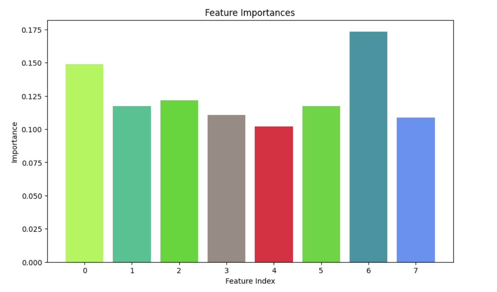
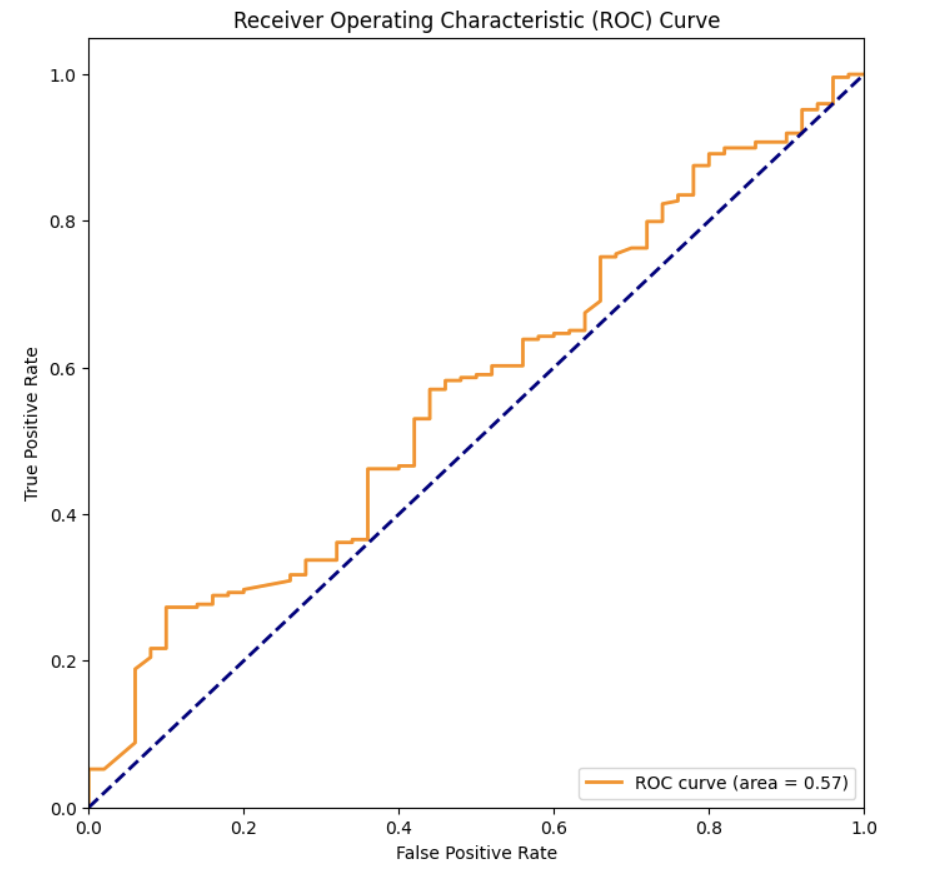
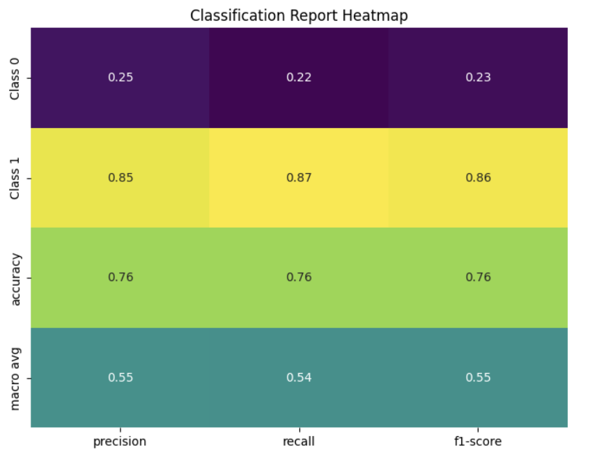

# Rice & Chips Classifier


## Overview

This machine learning project classifies images of dishes to determine if they contain rice or chips. It leverages advanced image processing and classification algorithms to recognize subtle visual cues like texture, color, and arrangement.

## Machine Learning Pipeline

The project follows a robust machine learning pipeline:
- **Data Loading and Exploration**:
  - Explore the dataset to understand its structure and characteristics.
- **Image Processing and Feature Extraction**:
  - Apply various image processing techniques and extract essential features for classification.
- **Normalization and Resampling**: -
  - Ensure balanced and normalized data using techniques like SMOTE.
- **Model Training and Evaluation**:
  - Train multiple models, including Logistic Regression, Random Forest, and XGBoost, and evaluate their performance.

## Project Structure

```plaintext
- 📂 Code
  - 📄 preprocessing.py
  - 📄 modeling.py
- 📂 Data
  - 📄 MLEndYD_image_attributes_benchmark.csv
- 📂 Model
  - 📄 random_forest_model.pkl
- 📂 Notebooks
  - 📄 Full_Code.ipynb
- 📂 Sample_Images
  - 📂 Rice
  - 📄 1.jpg
  - 📄 2.jpg
  - 📄 3.jpg
  - 📄 4.jpg
  - 📄 5.jpg
  - 📂 Chips
  - 📄 1.jpg
  - 📄 2.jpg
  - 📄 3.jpg
  - 📄 4.jpg
  - 📄 5.jpg
- 📄 LICENSE
- 📄 README.md
```
## Downloading the Image Dataset
The Image Dataset can be imported from MLend library to your Google Drive. Steps are given in Full Code.

## Clone the repository:
  ```bash
  git clone https://github.com/Shobhit1110/Rice-Chips_Machine_Learning_model.git
  
  ```
## Run the full code script:
```bash
python Full_Code.py

```
## Results

### Confusion Matrix - Random Forest Classifier



### Feature Importance



### ROC - Curve



### Classification Report



## Future Improvements

While the Random Forest Classifier shows strong performance, future improvements could include:

- Hyperparameter tuning for better model optimization.
- Data augmentation techniques to enhance dataset diversity.
- Detailed analysis of misclassified instances for model refinement.

## License
This project is licensed under the MIT License - see the LICENSE file for details.


